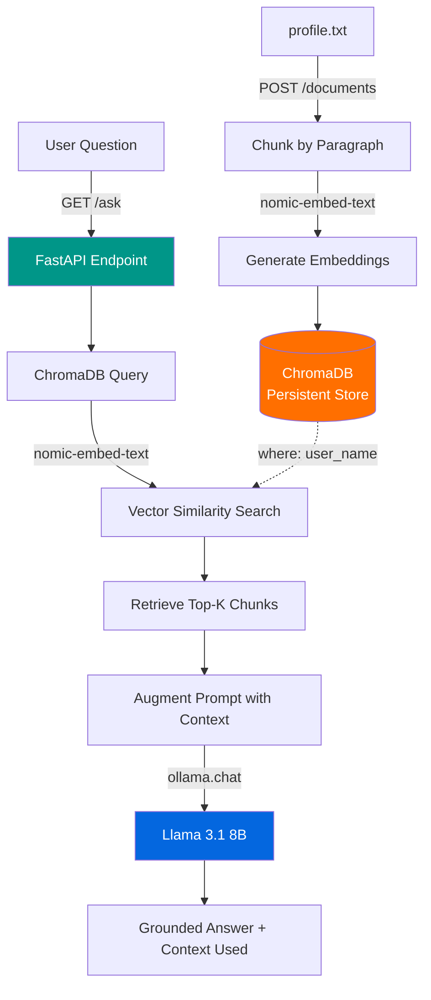

# 🔍 Local AI RAG API with FastAPI, ChromaDB & Ollama

**Project Link:** [View Project](https://github.com/elforestal/local-rag-api)

**Author:** Edith Forestal
**GitHub:** [elforestal](https://github.com/elforestal)
**LinkedIn:** [linkedin.com/in/forestal](https://linkedin.com/in/forestal)

---

## 30-Second Summary

I built a fully local Retrieval-Augmented Generation (RAG) API using FastAPI, ChromaDB, and Ollama that grounds AI responses in my own documents instead of a model's static training data — with zero cloud dependency and zero third-party data exposure.

This project extends the on-device AI pattern I established with my [local SOC log analyzer](#), and it's the same retrieval/embedding/access-control architecture I'll need to secure in enterprise AI deployments.

---

## Architecture

Everything in this diagram — embedding generation, vector storage, and answer generation — runs on-device via Ollama. No data leaves the machine at any stage of the pipeline.

---

## Tools & Technologies

| Category | Tools |
|---|---|
| **API Framework** | FastAPI, Uvicorn (ASGI server, `--reload` for dev) |
| **Vector Database** | ChromaDB (PersistentClient, metadata filtering) |
| **Local LLM Runtime** | Ollama |
| **Generation Model** | Llama 3.1 8B (substituted for the lab's default qwen2.5:0.5b) |
| **Embedding Model** | nomic-embed-text (768-dimensional vectors) |
| **Data Validation** | Pydantic (`BaseModel` for request schema enforcement) |
| **Testing** | Swagger UI (FastAPI's auto-generated interactive docs) |
| **Language** | Python 3.13 |

---

## Why This Project Matters (Security Framing)

RAG systems are the backbone of most production AI knowledge bases — internal document search, support-ticket assistants, and product-catalog Q&A all use this exact retrieval → augmentation → generation pattern. Understanding it from the ground up, including where it breaks down from a security perspective, is directly relevant to securing enterprise AI deployments.

Key security-relevant concepts this project surfaces:

- **Data residency** — running the full pipeline locally means no document content, embeddings, or queries transit to a third-party API. This matters when the data source is sensitive (HR records, contracts, internal knowledge).
- **Metadata filtering as access control** — ChromaDB's `where` clause is a lightweight form of attribute-based access control (ABAC), scoping retrieval to a specific user's data at query time.
- **The limits of that access control** — this implementation has no authentication layer, which I documented explicitly below rather than glossing over.

---

## Performing RAG Manually

Before writing any code, I ran a manual RAG demo to understand the mechanism before automating it.

I asked Llama 3.1 a personal question with no context first, then again with my own background pasted directly into the prompt.

**The three parts of RAG:**
1. **Retrieval** — finding the relevant text about myself
2. **Augmentation** — inserting that text into the prompt alongside the question
3. **Generation** — the model producing an answer grounded in that context

### Comparing the two models

nomic-embed-text converts text into vector embeddings for semantic search; llama3.1:8b is a conversational model that generates human-readable responses. One does retrieval, the other does generation — they're not interchangeable. ChromaDB calls nomic-embed-text behind the scenes to build the knowledge base, while my `/ask` endpoint calls llama3.1:8b to write the actual answer.

---

## Building the Knowledge Base

I wrote a personal profile document (`profile.txt`), then built a Python script (`build_knowledge_base.py`) that chunks it by paragraph, generates embeddings via nomic-embed-text, and stores both text and vector in a persistent ChromaDB collection.

Embeddings are numerical representations of text that capture meaning — similar concepts end up close together in vector space, which is what enables semantic search instead of exact keyword matching.

### How semantic search finds relevant chunks

When a question comes in, ChromaDB converts it into a vector using the same embedding model, then compares that vector against every stored chunk to find the closest matches in high-dimensional space. This is semantic search — matching on meaning rather than exact keywords.

---

## Building the RAG API

I built a FastAPI application with a `/ask` GET endpoint that implements the full pipeline: retrieve the top 2 relevant chunks from ChromaDB, augment a prompt template with that context, and generate a grounded answer via Llama 3.1.

I tested it using FastAPI's built-in Swagger UI — auto-generated interactive documentation from the code's type hints, no separate tool like Postman required.

**Test case:** Asked "What is my name?" — the API returned my name correctly, sourced from the retrieved profile chunk, along with the `context_used` field showing exactly which chunks were retrieved (verifiable, non-black-box output).

---

## Extending to a Multi-User AI Directory

Real-world RAG systems almost always serve multiple users or data sources, not a single static document. I extended the API to support multi-tenancy:

- Added a `POST /documents` endpoint that accepts a `user_name` and `content` field (validated via a Pydantic `DocumentSubmission` model), chunks the submission, and stores it with the user's name attached as ChromaDB metadata.
- Updated the `/ask` endpoint to accept an optional `user` query parameter. When provided, ChromaDB's `where` filter scopes the vector search to only that user's chunks.

**Verifying the filter works:** I asked "What are their hobbies?" first with no user filter, then again with `user=Jordan`. The unfiltered query pulled mixed context from both my profile and Jordan's — the AI had no way to know which chunk belonged to which person. The filtered query returned only Jordan's hobbies (rock climbing, cooking, chess), because ChromaDB excluded my chunks from the search before it ran.

---

## Gaps, Deviations & Production Fixes

| Issue | Current State | Production Fix |
|---|---|---|
| **No authentication on `/documents` or `/ask`** | Anyone with network access to the API can write or query any user's data | Add API key or OAuth token validation; scope write/read access per authenticated identity |
| **No rate limiting** | Endpoints accept unlimited requests | Add request throttling (e.g., `slowapi`) to prevent abuse and resource exhaustion |
| **No input sanitization beyond type validation** | Pydantic validates shape (`str`, `str`) but not content | Add length limits and content checks on submitted profile text to prevent injection into the LLM prompt |
| **PII in `profile.txt` and ChromaDB store** | Real personal data used during local testing | Public repo uses a sanitized placeholder profile; real data never committed |
| **Model substitution not abstracted** | `llama3.1:8b` hardcoded directly in `ollama.chat()` calls in two places | Move model name to an environment variable / config file so it's changed in one place |
| **Retrieval noise at low `n_results`** | With a small profile, `n_results=2` sometimes returns a marginally relevant second chunk alongside the correct one | Tune `n_results` and/or add a similarity-score threshold to filter weak matches before augmenting the prompt |

---

## Troubleshooting Log

**Issue:** `ollama._types.ResponseError: model 'qwen2.5:0.5b' not found (status code: 404)`

**Cause:** The lab's `main.py` hardcodes `model="qwen2.5:0.5b"` in the `ollama.chat()` call, but I never pulled that model — my machine has `llama3.1:8b` installed instead (better fit for available hardware).

**Fix:** Updated every `ollama.chat()` call — in both the base `/ask` endpoint and the multi-user version — to reference `llama3.1:8b`. Since this string is duplicated across the file, missing one instance was the easiest way to reintroduce this same error.

---

## Key Tools and Concepts Learned

**Tools:** FastAPI, ChromaDB, Ollama, Llama 3.1 — running fully local with no cloud dependency or API costs.

**Concepts:** The three-stage RAG pipeline (retrieval, augmentation, generation), vector embeddings for semantic search, and metadata filtering as a lightweight ABAC mechanism for scoping data access in a multi-tenant system.

**Time to complete:** ~2 hours. The most challenging part was tracking down every hardcoded model reference across both versions of `main.py` after substituting my own model.

**Next skill to build:** Containerizing this API with Docker — the natural next step toward a deployable, production-shaped version of this project.

---

## Related Portfolio Work

This project extends the on-device AI pattern from my local SOC log analyzer and pairs with my broader AI/cloud security work.

**Full portfolio:** [https://github.com/elforestal](https://github.com/elforestal)
